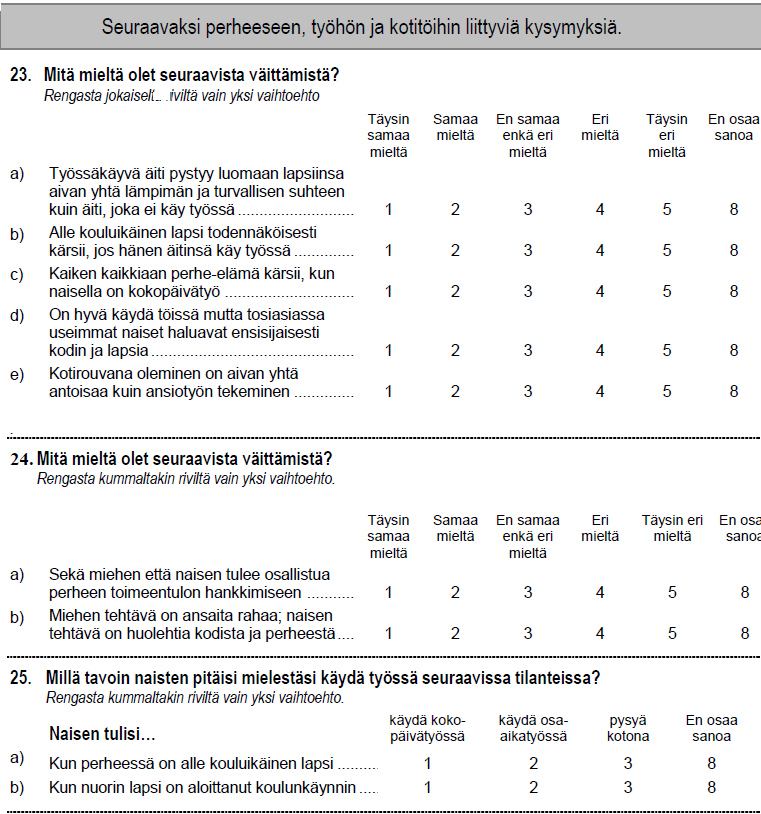

# Data

**edit** tässä luvussa on paljon siistittävää, mutta data on ok. (13.5.2018).
**edit** capaper - dokumentissa parempi uusi jäsentely (4.9.2018)
**edit** ISSP-datan perustietoa dokumentissa ISSP_data1.docx (4.9.2018)
**edit** koodilohkoja ei vielä siistitä, eikä nimetä capaper-vaatimusten mukaan.

**edit 24.9.18 Poistettiin turhaa, uusi versio tiedostosta (G1_1_data1.Rmd -> G1_1_data2.Rmd).**


```{r paketit_g11, include=FALSE}
# pitääkö laittaa järjestykseen, vanhemmat ensin?
library(rgl)
library(ca)
library(haven)
library(dplyr)
library(knitr)
library(tidyverse)
library(lubridate)
library(rmarkdown)
library(ggplot2)
library(furniture)
library(likert)
library(scales)   # ggplot2 - kuvalle
library(reshape2) # ggplot2 - kuvalle
# ehkä viimeiseksi sessionInfo() ja tämä koodi piiloon?
#sessionInfo()

```


## Luvun 1 tavoitteet

**Datan esittely ja kuvailut - tämä luku täysin uusiksi (24.9.18)**

**10.10.2018 maat ja muuttujat valittu.**

**TODO** Miten tämä dokkari siistitään? Vanha teksti omiksi tägätyiksi pätkiksi?


2012 data, muuttujaluokat (subst, demog.). Lisäksi maakohtaisia juttuja.


1. Eksploratiivinen ja graafinen menetelmä tarvitseen aineiston, hankalaa esitellä jollain synteettisellä esimerkkiaineistolla. **edit** Eksp&graaf menetelmät määriteltävä johdantoluvussa.
Esimerkkiaineistoja (synteettisiä kuten smoke, myös muita) on mm. ca - paketissa.

2. CA (ja MCA) sopivat isojen moniulotteisten ja mutkikkaiden aineistojen analyysiin, siksi iso aineisto. Samalla analyysiä voi laajentaa moneen suuntaan. **V** Benzecri:"kun data menee miljoonaan suuntaan".

3. Aineiston esittely, laajan kyselytutkimusaineiston tyypilliset ominaisuudet

4. Laadukkaan ja hyvin dokumentoidun aineiston edut

5. Tärkeä rajaus: CA sopii ja sitä on käytetty myös hyvin toisen tyyppisiin aineistoihin (ekologia ja biologia, arkeologia, kielen tutkimus)

 

## Perhe ja muuttuvat sukupuoliroolit - ISSP:n kyselytutkimuksen data 2012

Hieman historiaa datasta, sosiaalisesti määräytyneen sukupuoliroolit (gender) tutkimusaiheena neljässä kansainvälisessä kyselytutkimuksessa.

**Tärkeät linkit**

www.issp.org, tutkimushankkeen historiaa. Löytyy myös bibliografia tutkimuksista, joissa aineistoja on käytetty.

www.gesis.org - tutkimuksen "sihteeristö", dokumentaatio ja datat.

data ja dokumentaatio (selattavissa): zacat.gesis.org

**edit** tässä järkevä viite ISSP - dataan
ISSP Research Group (2016): International Social Survey Programme: Family and Changing Gender Roles IV - ISSP 2012. GESIS Data Archive, Cologne. ZA5900 Data file Version 4.0.0, doi:10.4232/1.12661 **tämä doi-linkki ei toimi**

**Linkitys on hankalaa**

* monta portaalia, joista pääsee monien organisaationimien taakse
* tästä lyhyt selostus
* tärkeimmät linkit ISSP-tutkimuksen "kotisivu" ja selkeä **muuttujakuvaukset ja muut tiedot**
* käytännössä linkittäminen "syvälle" johonkin sivustoon tai www-palveluun ei ole järkevää, parempi antaa selkeät viitetiedot ja tiedot organisaatioista. Ne kyllä säilyvät, tai jäljille pääsee.

[Aineistot](https://dbk.gesis.org/dbksearch/sdesc2.asp?no=5900&db=e) 2012 **toimii - ja viitetieto tuossa edellä!** **V**

[Muuttujakuvaukset ja muut tiedot](http://zacat.gesis.org/webview/index.jsp?object=http://zacat.gesis.org/obj/fStudy/ZA5900) **OK - täältä löytyy oikeastaan kaikki!**

[Data ja dokumentit](https://dbk.gesis.org/dbksearch/sdesc2.asp?no=5900&db=e) **vie vain aineiston dokumentoinnin etusivulle**

[Suomenkielinen lomake (ZA5900_q_fi-fi.pdf)](https://dbk.gesis.org/dbksearch/sdesc2.asp?no=5900&db=e&doi=10.4232/1.12661) **vie vain aineiston dokumentoinnin etusivulle**

[Käyttöehdot:](https://www.gesis.org/en/services/data-analysis/more-data-to-analyze/data-archive-service/) **GESIS-palvelun datan yleiset käyttöehdot, viittauskäytännöt**

[Tiedonkeruumenetelmä ja otoskoko:](https://dbk.gesis.org/dbksearch/sdesc2.asp?no=5900&db=e&doi=10.4232/1.12661) **
Viimeisin Portugali 29.06.2014 - 31.01.2015, ensimmäinen Bulgaria 16.08.2011 - 20.09.2011. Suurin osa muista 2012-13, kuten Suomi (21.09.2012 - 07.12.2012 ). 

**Vie tutkimushankkeen "kotisivulle"** ZA5900: International Social Survey Programme: Family and Changing Gender Roles IV - ISSP 2012

Havaintojen lukumäärät voi tarkistaa [täältä](http://zacat.gesis.org/webview/index.jsp?object=http://zacat.gesis.org/obj/fStudy/ZA5900) .
**Vie aineiston dokumentointisivustoon, jossa helppo navigoida** zacat.gesis.org.

edit: aineiston kuvailua voi ja kannattaakin jatkossa tarkentaa, ja laittaa se liitteeksi(?- tuskinpa). Dokumentointi on hyvin tarkka, tiedot löytyvät haastattelumenetelmista (parerilomake, tietokoneavusteinen haastattelu, jne), maakohtaisten taustamuuttujien harmonisoinnista maittain, otantamenetelmistä jne. Esittelen vain aineiston tärkeimmät rajaukset. 

## Aineiston rajaaminen

**zxy** Aineiston kuvailu omana osanaan (7.8.2018).
**zxy** capaper - dokumentissa uusi jäsentely (4.9.2018)

Ainestossa (jatkossa ISSP2012) on kyselytutkimukseen tulokset 41 maasta. Lisäksi aineistossa on runsaasti demografisia ja muita taustatietoja. R-koodista selviää käytetty versio (SPSS-tiedoston nimi) ja rajauksessa käytetyt muuttujat.

**Rajaukset**

**zxy** Aineiston luonne: maakohtaisesti eri tavoin kerätty data, jossa pyritään yhtenäisiin käytäntöihin ja tietosisältöihin. Silti myös substanssikysymyksissä eroja, isoja ja pienempiä. Näin vain on, en pohdi miksi. Ei ole mitenkään ainutlaatuista. Aineiston editoinnissa ja tiedonkeruun suunnittelussa on nähty paljon vaivaa vertailukelpoisuuden vuoksi. Tästä esimerkkejä, esim. "mitä puoluetta äänestit".


**1. Eurooppa ja samankaltaiset maat (28)**

Bulgaria, Czech Republic, Denmark, Finland,France, Germany, Great Britain, Ireland, Latvia, Lithuania, Norway, Poland, Sweden, Slovakia, Slovenia,Spain, Switzerland, Australia, Austria, Canada, Croatia, Iceland, Russia, United States, Belgium, Hungary, Netherlands, Portugal **(28) - Espnaja, Great Britain, USA pois -> 25 (11.10.18)**

**Pois 13:** Argentiina,Turkki, Venezuela, Etelä-Afrikka, Korea, Intia, Kiina, Taiwan, Filippiinit, Meksiko, Israel, Japani, Chile.


**2. Maat joissa varsinaisissa tutkimuskysymyksissä on käytetty poikkeavia luokitituksia tms.** 

Espanja ja Unkari(V18 - V20) ovat muuttaneet ISSP-kysymyksiä. Lähes kaikilla mailla on monissa hieman erialaisia muotoiluja.

Lisäksi iso joukko tietoja on kerätty kansallisilla kysymysversioilla.

Espanja pois, USA ja GB pois koska TOPBOT-muuttuja puuttuu (11.10.18)

**25 maata, johdattelevassa esimerkissa 6 maata** (11.10.18)


**3. kaikki havainnot, joissa on puuttuvia tietoja.** 

Puuttuvia tietoja on yllättävän vähän. Jätetään silti kaikki ne havainnot pois, joissa joku tieto puuttuu. Rajataan kuitenkin tätä vaikutusta niin, että sitä sovelletaan vain käytettäviin muuttujiin.

Johdattelevassa esimerkissä on kolme muuttujaa, ei ongelma.

Isomman 25 aineiston osalta tarkistetaan, mitä "listwise deletion" saa aikaan. Yksinkertaisinta olisi pudottaa kaikki havainnot, joissa on puuttuvia tietoja joissain valituissa (isommassa joukossa) muuttujia (10.10.18).

Tämä rajaus on kyselytutkimuksessa ankara, tai oikeastaan kelvoton. Oikea menettely olisi imputoida jollain menetelmällä puuttuvat tiedot, mutta rajaan otantatutkimuksen menetelmät tutkielman ulkopuolelle (aiheesta löytyy artikkeleita...).Yksittäisten vastausten puuttuminen eli erävastauskato ohitetaan aluksi, mutta siihen palataan. Korrespondenssianalyysiin on helppo ottaa mukaan myös puuttuvat tiedot, sillä data on luokitteluasteikon dataa. Yksikkövastauskato eli otokseen poimitut joita ei ole tavoitettu ollenkaan on kansallisen tason ongelma, joka on ratkaistu vaihtelevin tavoin. Tiedot löytyvät aineiston dokumentaatiosta. Aineistossa on myös mukana painomuuttujat, mutta ne soveltuvat vain jokaisen maan omaan aineistoon.

**zxy** Tärkein rajaus esimerkkianalyyseissä, ja voidaan esitellä CA:n käyttö puuttuvien vastausten analysoinnissa (Likert-asteikkolla).


4. Datan hallinta **liittyy reproducible research- periaatteeseen**


Aineistoa käsitellään ja muokataan niin, että jokaisen analyysin voi mahdollisman yksinkertaisesti toistaa suoraan alkuperäisestä datasta.

Aineiston muokkauksen (muuttujien ja havaintojen valikointi, muunnokset ja uusien muuttujien luonti jne.) dokumentoidaan r-koodiin.

**zxy 3.10.18** 

Kun SPSS-tiedosto luetaan R:n data frame - tiedostoksi, mukana tulee myös metadata. Uusien muuttujien luonnissa tai data-formaatin vaihtuessa (esim. matriisiksi, taulukoksi jne) metadata katoaa. 

Helposti toistettava tutkimus: polku alkuperäisestä datasta analyysien dataan selkeä (ja lyhyt jos mahdollista).

Muuttujien tyyppimuunnokset (yleensä faktorointi) tallennetaan uusiksi muuttujiksi, metatieto säilyy vanhassa muuttujassa.


**Tiedostonimistä 10.10.18**

ISSP2012.data (df) jossa alkuperäinen SPSS-data
ISSP2012jh1.data osajoukko edellisestä
    ISSP2012jh1a.data - valitaan maat jne. Kerrottu alempana.
    **huom** tiedostonimessä ei kerrota R-tiedostotyyppiä (?), tulisi liikaa lyhenteitä.

ISSP2012esim1.dat edellisen osajoukkoja, joissa uusia muuttujia ja tyyppimuunnoksia. Nämä vaihtuvat analyysin vaihden mukaan, jotta polku olisi lyhyt. Tästä tulee toistoa R-koodiin, mutta ei liikaa ja sopii myös Markdown-työskentelyyn. Jaksot erillisiä Rmd-tiedostoja, jokaisen alussa ladataan r-paketit ja data. Tallennetaan datan lukukoodi omaksi tiedostoksi, näin on jo tehty paketeille (paketit.R)


**zxy** Datan rajaaminen (maat. muuttujat) heti alussa, pieni ristiriita eksploratiivisen data-analyysin perusidena kanssa? No oikeastaan ei, sillä 420 muuttujan aineisto on hieman työläs vaikkapa listauksissa. Muuttujien nimiä joutuu kaivelemaan pitkistä listauksista.

 
**zxy** R-koodiin jätetään myös tarkistuksia yms. joita ei raportoida tässä, samoin niiden tuloksia. Voiko R-koodi olla fingelskaa? 

**DATA RAJAAMISTA - maat(5.10.2018)**

```{r datasel_country1}
# Aineiston rajaamisen kolme vaihetta (10.1018)
# 
# TIEDOSTOJEN NIMEÄMINEN
#
# R-datatiedostot .data - tarkenteella ovat osajoukkoja koko ISSP-datasta ISSP2012.data
# R-datatiedostot .dat - tarkenteella: mukana alkuperäisten muuttujien muunnoksia 
# (yleensä as_factor), alkuperäisissä muuttujissa mukana SPSS-tiedoston metadata.
# Muutetaan R-datatiedossa alunperin ordinaali- tai  nominaaliasteikon muuttuja haven-paketin
# as_factor - funktiolla faktoreiksi. R:n faktorityypin muuttujille voidaan tarvittaessa 
# määritellä järjestys, toistaiseksi niin ei tehdä (25.9.2018)
#       
# R-datatiedostot joiden nimen loppuosa on muotoa *esim1.dat: käytetään analyyseissä
#
# 1. VALITAAN MAAT (25) -> ISSP2012jh1a.data. Muuttujat koodilohkossa datasel_vars1
#
# kolme maa-muuttujaa datassa. V3 erottelee joidenkin maiden alueita, V4 on koko maan
# ja C_ALPHAN on maan kaksimerkkinen tunnus.
#
# V3 - Country/ Sample ISO 3166 Code (see V4 for codes for whole nation states)
# V3 erot valituissa maissa
# 5601 BE-FLA-Belgium/ Flanders
# 5602 BE-WAL-Belgium/ Wallonia
# 5603 BE-BRU-Belgium/ Brussels
# 27601 DE-W-Germany-West
# 27602 DE-E-Germany-East
# 62001 PT-Portugal 2012: first fieldwork round (main sample)
# 62002 PT-Portugal 2012: second fieldwork round (complementary sample)
# Myös tämä on erikoinen, näyttää olevan vakio kun V4 = 826:
# 82601 GB-GBN-Great Britain
# Portugalissa ainestoa täydennettiin, koska siinä oli puutteita. Jako ei siis ole oleellinen,
# mutta muuut ovat. Tähdellä merkityt maat valitaan johdattelevaan esimerkkiin.
#
# Maat (27, ei Espanjaa).Myös US ja Great Britan jätettiin lopulta pois eli maita jää 25
#
# 36 AU-Australia
# 40 AT-Austria
# 56 BE-Belgium*
# 100 BG-Bulgaria*
# 124 CA-Canada
# 191 HR-Croatia
# 203 CZ-Czech Republic
# 208 DK-Denmark*
# 246 FI-Finland*
# 250 FR-France
# 276 DE-Germany*
# 348 HU-Hungary*
# 352 IS-Iceland
# 372 IE-Ireland
# 428 LV-Latvia
# 440 LT-Lithuania
# 528 NL-Netherlands
# 578 NO-Norway
# 616 PL-Poland
# 620 PT-Portugal
# 643 RU-Russia
# 703 SK-Slovakia
# 705 SI-Slovenia
# 752 SE-Sweden
# 756 CH-Switzerland
# 826 GB-Great Britain and/or United Kingdom - jätetään pois jotta saadaan TOPBOT 
#                          -muuttuja mukaan (top-bottom self-placement) .(9.10.18)
# 840 US-United States - jätetään pois, jotta saadaan TOPBOT-muuttuja mukaan.(10.10.18)
#
# Belgian ja Saksan alueet:
#  V3
#  5601     BE-FLA-Belgium/ Flanders
#  5602     BE-WAL-Belgium/ Wallonia
#  5603     BE-BRU-Belgium/ Brussels
# 27601     DE-W-Germany-West
# 27602     DE-E-Germany-East
#
# Unkari (348) toistaiseksi mukana, mutta joissain kysymyksissä myös Unkarilla on 
# poikkeavia vastausvaihtoehtoja(HU_V18, HU_V19,HU_V20). Jos näitä muuttujia käytetään, 
# Unkari on parempi jättää pois. 
# 
#
# (25.4.2018) user_na  
# haven-paketin read_spss - funktiolla voi r-tiedostoon lukea myös SPSS:n sallimat kolme 
# (yleensä 7, 8, 9) tarkempaa koodia puuttuvalle tiedolle.
# "If TRUE variables with user defined missing will be read into labelled_spss objects. 
# If FALSE, the default, user-defined missings will be converted to NA"
# https://www.rdocumentation.org/packages/haven/versions/1.1.0/topics/read_spss
#
# (25.9.2018) jäteään pois. Tietoa ei käytetä, koodauksissa on myös eroja maiden ja eri 
# kysymysten välillä. Kaikki puuttuvat tiedot saavat R-tiedostossa arvon NA.
# R-ohjelmiston "implisiittinen konversio" muuntaa monet muuttujat (esim. Likert-asteikon 
# vastaukset 1,...,5) merkkijonomuuttujiksi.
# 
 
ISSP2012.data <- read_spss("data/ZA5900_v4-0-0.sav") #luetaan alkuperäinen data R- dataksi (df).

#str(ISSP2012.data)

incl_countries25 <- c(36, 40, 56,100, 124, 191, 203, 208, 246, 250, 276, 348, 352, 
                      372, 428, 440, 528, 578, 616, 620, 643, 703, 705, 752, 756)

#str(ISSP2012.data)
#str(ISSP2012.data) #61754 obs. of  420 variables - kaikki

ISSP2012jh1a.data <- filter(ISSP2012.data, V4 %in% incl_countries25)

#head(ISSP2012jh1a.data)
#str(ISSP2012jh1a.data) #34271 obs. of  420 variables, Espanja ja Iso-Britannia
#                       pois (9.10.2018)
#str(ISSP2012jh1a.data) # 32969 obs. of  420 variable, Espanja Iso-Britannia, 
#                        USA pois (10.10.2018)
#
#names(ISSP2012jh1.data) # muuttujen nimet
# Maakohtaiset muuttujat (kun on poikettu ISSP2012 - vastausvaihtoehdoista tms.) 
# on aineistossa eroteltu maatunnus-etuliitteellä (esimerkiksi ES_V7).
# Demografisissa ja muissa taustamuuttujissa suuri osa tiedoista on kerätty maa-
# kohtaisilla lomakkeilla. Vertailukelpoiset muuttujat on konstruoitu niistä.
# Muuttujia on 420, vain osa yhteisiä kaikille maille.
```


**Data-tiedoston tutkailua**

Koodilohkossa voi tarkastaa, mitä valittujen maiden koko datassa on.


```{r dataprop1, echo=TRUE}
# Datan selailua (9.10.2018)
#
#datatiedoston ominaisuuksia 1
#str(ISSP2012jh1.data$V5)

# tarpeetonta testailua 24.9.2018 - puuttuvien havaintojen kaivelua
# TÄMÄ VASTA KUN MUUTTUJAT ON VALITTU
#
# test1 <- is.na(ISSP2012jh1.data$V5)
# missV5 <- ISSP2012jh1.data[test1,]
# head(missV5)
# str(missV5)
# hist(missV5$V5)
# summary(missV5$V5)
# puuttuvan tiedon tarkempi koodaus - jos olisi user_na=TRUE read_spss-komenossa
# attr(ISSP2012jh1.data$V5,'labels')
# attr(ISSP2012jh1.data$V5,'na_values')

# Tästä näkyvät maakohtaiset substanssimuuttujat helposti!
# attr(ISSP2012jh1.data,'names')

# hist(ISSP2012jh1.data$V5) #kätevä mutta ei lopulliseen käyttöön
# hist(ISSP2012jh1.data$DEGREE)
#
# PERUSKOMENNOT DATATIEDOSTOSON TUTKIMISEEN
typeof(ISSP2012jh1a.data)
class(ISSP2012jh1a.data)
storage.mode(ISSP2012jh1a.data)
#attributes(ISSP2012jh1.data)
#
# tiedoston metadata : muuttujat V1, V2 ja DOI
#
ISSP2012jh1a.data[1:3,1:3]
```

Kolme ensimmäistä muuttujaa ovat datan metatietoja. Muuttujissa V12 ja V13 vastausvaihtoehdot ovat erilaiset, neutraali "ei samaa eikä eri mieltä" puuttuu. "En osaa sanoa" - vaihtoehto kasvattaa puuttuvien havaintojen määrää. Näissä EOS merkitykseltään erilainen. Labels (W, w, H ja jotain eos-vaihtoehdolle). 


Ikä (AGE) on kokonaisluku (**tarkista R-tyyppi 13.10.18**), taustamuuttujissa on monenlaisia koodauksia. Yhdistellään ja luokitellaan uudelleen tarvittaessa.

**DATAN RAJAAMISTA - MUUTTUJAT** (5.10.2018)


```{r datasel_vars1}
# 2. VALITAAN MUUTTUJAT  -> ISSP2012jh1b.data. Maat valittu koodilohkossa datasel_country1
#
#
# Muuttujat on luokiteltu dokumentissa ZA5900_overview.pdf
# https://zacat.gesis.org/webview/index.jsp?object=http://zacat.gesis.org/obj/fStudy/ZA5900
# Study Description -> Other Study Description -> Related Materials
# 
#

# METADATA

metavars1 <- c("V1", "V2", "DOI")

#MAA - maakoodit ja maan kahden merkin tunnus

countryvars1 <- c("V3","V4","C_ALPHAN")

#temp <- select(ISSP2012jh1.data, metavars1)
#str(temp)

# SUBSTANSSIMUUTTUJAT - Attitudes towards family and gender roles (9)
#
# Yhdeksän kysymystä (lyhennetyt versiot, englanniksi), vastausvaihtoehdot Q1-Q2
#
# 1 = täysin samaa mieltä, 2 = samaa mieltä, 3 = ei samaa eikä eri mieltä, 
# 4 = eri mieltä, 5 = täysin eri mieltä
# 
# Q1a Working mother can have warm relation with child
# Q1b Pre-school child suffers through working mother
# Q1c Family life suffers through working mother
# Q1d Women’s preference: home and children
# Q1e Being housewife is satisfying
#
# Q2a Both should contribute to household income
# Q2b Men’s job is earn money, women’s job household
#
# Q3a Should women work: Child under school age 
# Q3b Should women work: Youngest kid at school
#
#
# Kysymysten Q3a ja Q3b  Muut vastaustvaihtoehdot ovat 1= kokopäivätyö, 2 = osa-aikatyö ja 
# 3 = pysyä kotona. Eos-vastaus ei ole sama kuin "en samaa enkä eri mieltä" (ns. neutraali vaihtoehto), ja se pitäisi erotella
# muista puuttuvan tiedon koodeista. Tässä kaikki kolme SPSS- tiedoston vaihtoehtoa ovat puuttuvia tietoja (NA)

substvars1 <- c("V5", "V6","V7","V8","V9","V10","V11","V12","V13")

# Nämä jäävät pois:
#
# "V14","V15","V16",  "V17","V18","HU_V18","V19","HU_V19","V20","HU_V20","V21","V28","V29","V30","V31","V32","V33",
# "V34", "V35", "V36", "V37", "V38", "V39", "V40", "V41", "V42", "V43", "V44", "V45",
#  "V46", "V47", "V48", "V49", "V50", "V51", "V52", "V53", "V54", "V55", "V56", "V57", "V58", "V59",
#  "V60", "V61", "V62", "V63", "V64", "V65", "V65a","V66", "V67"
#

# DEMOGRAFISET JA MUUT TAUSTAMUUTTUJAT (8)
#
# AGE, SEX
#
# DEGREE - Highest completed degree of education: Categories for international comparison. 
# Slightly re-arranged subset of ISCED-97
#
# 0 No formal education
# 1 Primary school (elementary school)
# 2 Lower secondary (secondary completed does not allow entry to university: obligatory school)
# 3 Upper secondary (programs that allow entry to university or programs that allow to entry other ISCED level 3 programs - designed to
# prepare students for direct entry into the labour market)
# 4 Post secondary, non-tertiary (other upper secondary programs toward labour market or technical formation)
# 5 Lower level tertiary, first stage (also technical schools at a tertiary level)
# 6 Upper level tertiary (Master, Dr.)
# 9 No answer, CH: don't know
# Yhdistelyt?
#
# MAINSTAT - main status: Which of the following best describes your current situation?
#
# 1 In paid work
# 2 Unemployed and looking for a job, HR: incl never had a job
# 3 In education
# 4 Apprentice or trainee
# 5 Permanently sick or disabled
# 6 Retired
# 7 Domestic work
# 8 In compulsory military service or community service
# 9 Other
# 99 No answer
# Armeijassa tai yhdyskuntapalvelussa muutamia, muutamissa maissa.Kategoriassa 9 
# on hieman väkeä. Yhdistetään 8 ja 9. Huom! Esim Puolassa ei yhtään eläkeläistä
# eikä kategoriaa 9, Saksassa ei ketään kategoriassa 9.
#
# TOPBOT - Top-Bottom self-placement (10 pt scale)
#
# "In our society, there are groups which tend to be towards the top and groups 
# which tend to be towards the bottom. Below is a scale that runs
# from the top to the bottom. Where would you put yourself on this scale?"
# Eri maissa hieman erilaisia kysymyksiä. 
#
# HHCHILDR - How many children in household: children between [school age] and
# 17 years of age
#
# 0 No children
# 1 One child
# 2 2 children
# 21 21 children
# 96 NAP (Code 0 in HOMPOP)
# 97 Refused
# 99 No answer
# koodataan dummymuuttujaksi lapsia (1) - ei lapsia (0) ?
#
# MARITAL - Legal partnership status 
#
# What is your current legal marital status?
# The aim of this variable is to measure the current 'legal' marital status '. 
# PARTLIV - muuttujassa on 'de facto' - tilanteen tieto parisuhteesta
#
# 1 Married
# 2 Civil partnership
# 3 Separated from spouse/ civil partner (still legally married/ still legally 
#   in a civil partnership)
# 4 Divorced from spouse/ legally separated from civil partner
# 5 Widowed/ civil partner died
# 6 Never married/ never in a civil partnership, single
# 7 Refused
# 8 Don't know
# 9 No answer
#
# URBRURAL - Place of living: urban - rural
#
# 1 A big city
# 2 The suburbs or outskirts of a big city
# 3 A town or a small city
# 4 A country village
# 5 A farm or home in the country
# 7 Other answer
# 9 No answer
# 1 ja 2 vaihtelevat aika paljon maittain, parempi laskea yhteen. Unkarista puuttuu 
# jostain syystä kokonaan vaihtoehto 5.  Vaihotehdon 7 on valinnut vain 4 vastaajaa Ranskasta.
# Yhdistetään 1 ja 2 = city, 3 = town, rural= 4, 5, 7
#

bgvars1 <- c( "SEX","AGE","DEGREE", "MAINSTAT", "TOPBOT", "HHCHILDR", "MARITAL", "URBRURAL")

#Valitaan muuttujat

jhvars1 <- c(metavars1,countryvars1, substvars1,bgvars1)

#jhvars1
ISSP2012jh1b.data <- select(ISSP2012jh1a.data, jhvars1) 
str(ISSP2012jh1b.data) #32969 obs. of  23 variables
#summary(ISSP2012jh1b.data$C_ALPHAN)
```

Metatietojen ja maa-muuttujien lisäksi aineistossa on viisitoista muuttujaa. Seitsemä muuttujaa ovat ns. substanssikysymysten vastauksia, joilla luodataan asenteita sukupuolirooleihin ja perhearvoihin.

**Yhdeksän kysymystä (lyhennetyt versiot, englanniksi), vastausvaihtoehdot**

Vastausvaihtoehdot:

1 = täysin samaa mieltä, 2 = samaa mieltä, 3 = ei samaa eikä eri mieltä, 
4 = eri mieltä, 5 = täysin eri mieltä


Q1a Working mother can have warm relation with child
Q1b Pre-school child suffers through working mother
Q1c Family life suffers through working mother
Q1d Women’s preference: home and children
Q1e Being housewife is satisfying
Q2a Both should contribute to household income
Q2b Men’s job is earn money, women’s job household

Vastausvaihtoehdot: 
"Work full-time" "Work part-time" "Stay at home"
1 = W, 2 = w, 3 = H, NA = 6,8,9 ei tässä eriteltynä


Q3a Should women work: Child under school age
Q3b Should women work: Youngest kid at school


Kahdeksan demografista ja muuta taustamuuttujaa on kuvattu koodilohkon kommenteissa.

```{r vartable1, fig.cap="ISSP2012:Työelämä ja perhearvot - valitut muuttujat"}
# Muuttuja taulukkona
#head(ISSP2012jh1b.data)
#str(ISSP2012jh1b.data)
#
#attributes(ISSP2012jh1b.data)
#temp1 <- attr(ISSP2012jh1b.data$V5, 'label') #labelin saa luettua
#temp1
#attr(ISSP2012jh1b.data[,7:21], 'labels') # tuloksena NULL
#temp1[1]
#str(temp1$names)
#ISSP2012jh1b.data$V6
#lapply(ISSP2012jh1b.data, class) # muuttujat joilla labeleita
#labels(ISSP2012jh1b.data, which = c("V6","V7")) hämärä
#str(substvars1)
# Karkea tapa
tabVarnames <- c(substvars1,bgvars1) # muuttujanimet muuttujille, ei maa- tai metamuuttujia
#tabVarnames
tabVarDesc <- c("Q1a Working mother can have warm relation with child",
                "Q1b Pre-school child suffers through working mother",
                "Q1c Family life suffers through working mother",
                "Q1d Women’s preference: home and children",
                "Q1e Being housewife is satisfying",
                "Q2a Both should contribute to household income",
                "Q2b Men’s job is earn money, women’s job household",
                "Q3a Should women work: Child under school age",
                "Q3b Should women work: Youngest kid at school",
                "Respondents age ",
                "Respondents gender",
                "Highest completed degree of education: Categories for international comparison",
                "Main status: work, unemployed, in education...",
                "Top-Bottom self-placement (10 pt scale)",
                "How many children in household: children between [school age] and 17 years of age",
                "Legal partnership status: married, civil partership...",
                "Place of living: urban - rural"
              )
#tabVarDesc

# Taulukko
# luodaan df
jhVarTable1.df <- data_frame(tabVarnames,tabVarDesc)
cols_jhVarTable1 <- c("muuttuja","lyhennetty kysymys")
colnames(jhVarTable1.df) <- cols_jhVarTable1
#jhVarTable1.df

# Suomalaiset pitkät kysymykset
vastf1 <- c("Työssäkäyvä äiti pystyy luomaan lapsiinsa aivan yhtä lämpimän 
            ja turvallisen suhteen kuin äiti, joka ei käy työssä")

vastf2 <- c("Alle kouluikäinen lapsi todennäköisesti kärsii, jos hänen äitinsä käy työssä.")
vastf3 <- c("Kaiken kaikkiaan perhe-elämä kärsii, kun naisella on kokopäivätyö.")
vastf4 <- c("On hyvä käydä töissä mutta tosiasiassa useimmat naiset haluavat 
            ensisijaisesti kodin ja lapsia.")

vastf5 <- c("Kotirouvana oleminen on aivan yhtä antoisaa kuin ansiotyön tekeminen.")
vastf6 <- c("Sekä miehen että naisen tulee osallistua perheen toimeentulon hankkimiseen.")
vastf7 <- c("Miehen tehtävä on ansaita rahaa; naisen tehtävä on huolehtia kodista ja perheestä.")
vastf8 <- c("Millä tavoin naisten pitäisi mielestäsi käydä työssä seuraavissa tilanteissa?
            Kun perheessä on alle kouluikäinen lapsi")
vastf9 <- c("Millä tavoin naisten pitäisi mielestäsi käydä työssä seuraavissa tilanteissa?
            Kun nuorin lapsi on aloittanut koulunkäynnin")

tabVarDesc_fi <- c(vastf1,vastf2,vastf3,vastf4,vastf5,vastf6,vastf7, vastf8,vastf9)
#tabVarDesc_fi
tabVarnames_subst <- c(substvars1)
jhVarTable1_fi.df <- data_frame(tabVarnames_subst,tabVarDesc_fi)
cols_jhVarTable1 <- c("muuttuja","suomenkielisen lomakkeen kysymys")
colnames(jhVarTable1_fi.df) <- cols_jhVarTable1


#  kable(booktab = T) # booktab = T gives us a pretty APA-ish table
# Lyhyet kysymykset englanniksi
knitr::kable(jhVarTable1.df, booktab=TRUE)

# Suomen lomakkeen kysymykset (löytyy myös kuva lomakkeen sivusta)
knitr::kable(jhVarTable1_fi.df, booktab=TRUE)
```

Tarkemmat kysymysten muotoilut poikkeavat tietysti hieman eri maiden välillä. Suomen lomakkeet täydelliset kysymykset voi tarkista tiedostosta ZA5900_q_fi-fi.pdf, löytyy zcat-sivustolta. Tarkemmat kuvaukset lähes tuhatsivuisessa koodikirjassa ZA5900_cdb.pdf (**refworks-viite?**).


Kysymyslomakkeesta voisi ehkä näyttää myös kuvan?

```{r suom_kys, out.width='50%', fig.align='center',fig.cap='Suomen lomake'}

```
```


**TODO 9.10.18** Tarkista tiedostojen nimeämiset

## Puuttuvat tiedot

**zxy** Kun muuttujat on valittu, voi lyhyesti vilkaista puuttuneisuutta. Muuten asia käsitellään aina, kun muuttujia otetaan mukaan analyysiin. Tai voi sen tässäkin ehkä esitellä, kerralla? Muuttujat voisi luetella laskevassa järjestyksessä puuttuneisuuden mukaan?

**zxy** Perusasiat havaintojen puuttellisuudesta kyselytutkimusissa. Yksikkövastauskato (unit non-response), eräsvastauskato (item non-response). Mitä on raportoitava, kun käytetään valmista aineistoa? Erävastauskato on silti ongelma, vaihtelee kysymyksittäin, vaikka se ei kovin suuri olekaan.

Yksikkövastauskato on otettu vaihtelevasti huomioon, kun kyselyn toteuttaja on editoinut ja tarkastanut datan. Eri maiden datassa on (mutta ei aina!) mukana painot mm. vastauskadon oikaiksemiseen **Viittet - tekninen raportti**. Myös selaimella voi zcat-sivustolla tutkailla kysymyksittäin.


Aineistossa on tarkempi kolmen luokan koodaus puuttuvalle tiedolle, ja sen saa halutessaan luettua R-dataan.

**zxy Miten puuttuneisuus kannattaa kuvailla? Löytyy dokumentaatiosta!**


**Puuttuneisuus muuttujassa V6 (kysymys Q1b) (esimerkki):** Ehkä tarpeetonta.


```{r muut1old}
# Miksi teksti on sinistä, ja oikean yläkulman painikkeet puuttuvat? (13.10.18)
#Vähän vanhentunutta puuttuneisuuden (erävastauskato) kuvailua
temp <- ISSP2012jh1b.data
temp$maa <-  as_factor(temp$C_ALPHAN)
temp$Q1b <- as_factor(temp$V6 )


#summary(temp)
#str(taulu1)
taulu1 <- temp %>% tableX(V6,maa,type = "count")
taulu1a <- taulu1[ ,1:13]
knitr::kable(taulu1a,digits = 2, booktabs = TRUE, 
             caption = "Kysymyksen Q1b vastaukset maittain")
taulu1b <- taulu1[ ,14:26]
knitr::kable(taulu1b,digits = 2, booktabs = TRUE, 
             caption = "Kysymyksen Q1b vastaukset maittain")
```

Koko aineistossa (valitut 27 maata) kysymyksen Q1b (muuttuja V6) vastauksista puuttuvia tietoja on 3,5 prosenttia (1219/34271).

```{r muut2old}
# Nämä tarkastelu jaksoon, jossa laajempi joukko muuttujia käyttöö

# Puuttuvien tietojen (erävastauskato) tarkastelua 9.10.18 - mitä tässä voisi olla?
# Taulukko kuten yllä, riveinä maat ja sarakkeina muuttujat, is.na -count?
# Faktoreiksi, ja summary! Ei tarvita, kyllä R on muuttanut puuttuvat tiedot jo NA-arvoiksi.
#str(ISSP2012jh1b.data)
#attributes(ISSP2012jh1b.data)
#names(ISSP2012jh1b.data)

#Faktoreiksi substanssi- ja taustamuuttujat TÄHÄN KELPO TIEDOSTONIMI
#temp$maa <- as_factor(temp$C_ALPHAN)
#temp$Q1a <- as_factor(temp$V5) #labels ainakin näihin
#temp$Q1b <- as_factor(temp$V6)
#temp$Q1c <- as_factor(temp$V8)
#temp$Q1d <- as_factor(temp$V9)
#temp$Q1e <- as_factor(temp$V10)
#temp$Q2a <- as_factor(temp$V11)
#temp$Q2b <- as_factor(temp$V12)
#temp$Q2b <- as_factor(temp$V12)
#temp$sp <- as_factor(temp$SEX) # tähän levels, labels
#temp$ika <- temp$AGE
#temp$edu <- as_factor(temp$DEGREE)
#temp$socstat<- as_factor(temp$MAINSTAT) 
#temp$class <- as_factor(temp$TOPBOT) 
#temp$nchild<- temp$HHCHILDR
#temp$legstat <- as_factor(temp$MARITAL)  
#temp$urb<- as_factor(temp$URBRURAL)

#test <-summary(temp) 
#str(test)
#head(test)
#test
#temp5 <- ISSP2012jh1b.data %>% tableX(C_ALPHAN, V6, type = "count")
#str(temp5)
#temp5
#maat ja havaintojen lukumäärät
#temp6 <- temp5[,7]
#temp6

```

**Puuttuvat tiedot ja "listwise deletion" - pientä pohdintaa...**


```{r muut3}
# Pohditaan hieman ovatko kaikki muuttujat käyttökelpoisia eli puuttuuko liikaa vastauksia
# Nämä taulukoinnit kuuluvat jaksoon, jossa lisämuuttujat otetaan käyttöön

# ISSP2012jh1b.data %>% tableX(C_ALPHAN, TOPBOT, type = "row_perc")
# puuttuvia tietoja yhteensä 3110/34271 9 prosenttia!
ISSP2012jh1b.data %>% tableX(C_ALPHAN, V5, type = "count")
ISSP2012jh1b.data %>% tableX(C_ALPHAN, V6, type = "count") #on jo ylempänä
ISSP2012jh1b.data %>% tableX(C_ALPHAN, V7, type = "count")
ISSP2012jh1b.data %>% tableX(C_ALPHAN, V8, type = "count")
ISSP2012jh1b.data %>% tableX(C_ALPHAN, V9, type = "count")
ISSP2012jh1b.data %>% tableX(C_ALPHAN, V10, type = "count")
ISSP2012jh1b.data %>% tableX(C_ALPHAN, V11, type = "count")
ISSP2012jh1b.data %>% tableX(C_ALPHAN, V12, type = "count")
ISSP2012jh1b.data %>% tableX(C_ALPHAN, V13, type = "count")
ISSP2012jh1b.data %>% tableX(C_ALPHAN, SEX, type = "count")
missAGE <- ISSP2012jh1b.data %>% tableX(C_ALPHAN, AGE, type = "count")
missAGE[,86:87]
ISSP2012jh1b.data %>% tableX(C_ALPHAN, DEGREE, type = "count")
ISSP2012jh1b.data %>% tableX(C_ALPHAN, MAINSTAT, type = "count")
ISSP2012jh1b.data %>% tableX(C_ALPHAN, TOPBOT, type = "count")
ISSP2012jh1b.data %>% tableX(C_ALPHAN, HHCHILDR, type = "count")
ISSP2012jh1b.data %>% tableX(C_ALPHAN, MARITAL, type = "count")
ISSP2012jh1b.data %>% tableX(C_ALPHAN, URBRURAL, type = "count")

#Taulukko puuttuvista tiedosista 11.10.2018
missQ1a <- ISSP2012jh1b.data %>% tableX(C_ALPHAN, V5, type = "count")
missQ1b <- ISSP2012jh1b.data %>% tableX(C_ALPHAN, V6, type = "count")
missQ1c <- ISSP2012jh1b.data %>% tableX(C_ALPHAN, V7, type = "count")
missQ1d <- ISSP2012jh1b.data %>% tableX(C_ALPHAN, V8, type = "count")
missQ1e <- ISSP2012jh1b.data %>% tableX(C_ALPHAN, V9, type = "count")
missQ2a <- ISSP2012jh1b.data %>% tableX(C_ALPHAN, V10, type = "count")
missQ2b <- ISSP2012jh1b.data %>% tableX(C_ALPHAN, V11, type = "count")
missSP <- ISSP2012jh1b.data %>% tableX(C_ALPHAN, SEX, type = "count")
missAGE <- ISSP2012jh1b.data %>% tableX(C_ALPHAN, AGE, type = "count")
#missAGE[,86:87]
missDEGREE <- ISSP2012jh1b.data %>% tableX(C_ALPHAN, DEGREE, type = "count")
missMAINSTAT <- ISSP2012jh1b.data %>% tableX(C_ALPHAN, MAINSTAT, type = "count")
missTOPBOT <- ISSP2012jh1b.data %>% tableX(C_ALPHAN, TOPBOT, type = "count")
missHHCHILDR <- ISSP2012jh1b.data %>% tableX(C_ALPHAN, HHCHILDR, type = "count")
missMARITAL <- ISSP2012jh1b.data %>% tableX(C_ALPHAN, MARITAL, type = "count")
missURBRURAL <- ISSP2012jh1b.data %>% tableX(C_ALPHAN, URBRURAL, type = "count")

```
USA:n datassa ei ole muuttujaa TOPBOT, ja puuttuvien tietojen osuus on yli kymmenen prosenttia. USA:n voisi ehkä jättää pois, ja muuttaa tässä MISSING-arvon numeerikseksi 99.? Olisko ok? Tulee silti pulmia, joissain maissa puuttuvia tietoja on nolla tai ihan muutaman. Muiden 1-10 - asteikon muuttujia voi yhdistellä, mutta puuttuvaa tietoa on hankala yhdistää mihinkään. Ehkä tämä muuttuja jätetään pois? Jätetään USA pois**(10.10.18)**

**ainoa ratkaisu taitaa olla se, että (a) katsotaan paljonko putoaa havaintoja jos "listwise deletion" ja (b) koodataan puuttuva tieto omaksi kategoriaksi**


**Puuttuvien tietojen tarkempaa koodausta ei enään mietitä (3.10.2018) **

Puuttuvien tietojen tarkempi koodaus ISSP-datassa:

(zxy 24.9.2018 Tällaisia eroja löytyy, ohitetaan mutta mainitaan. Pitäisikö (a) pudottaa kaikki joilla puuttuvia joissain muuttujissa vai (b) yhdistää NA ja eos?)

Esimerkiksi Ruotsin puuttuviksi tiedoiksi koodatuista 29 havainnosta 19 valitsi "can't choose"(8) ja 10 kieltäyti vastaamasta (9) tms. Dokumentti, s.12.

Tarkastellaan aineston puuttuvia havaintoja hieman tarkemmin. Puuttuvat tiedot on koodattu aineistoon näin:
0: Not applicapble (NAP), Not available (NAV)
7: (97,997, 9997,...): Refused
8: (98, 998, 9998,...): Don't know
9: (99, 999, 9999,...): No answer

NAP ja NAV määritellään

"GESIS adds 'Not applicable'(NAP) codes for questions that have filters. NAP indicates that only a subsample and not all of respondents were asked. Also in the case of country spesific variables, all the other countries are coded NAP.

GESIS adds 'Not available' for variables, which in singe countries may  not have been conducted for whatever reason."


** (3.10.2018) Puuttuvien tietojen rajaava vaikutus raportoidaan, kun tietoja rajataan. Ei pohdita tämän enempää**

## Substanssimuuttujat, taustamuuttujat, muut

**zxy** capaper - lukuun.

**zxy** muuttujien kuvaukset. 

**zxy** tässä myös maakohtaisen poikkeavat kysymykset, joita riittää aika lailla.

**zxy** HUOM! Dataa ei ole kerätty vain kansainvälisiin vertailuhihin! Sitä voi ja ehkä pitäisikin analysoida maa kerrallaan, ja vertailla näitä tuloksia. (**#V** Blasiuksen artikkeli, jossa arvioidaan yhden ISSP-tutkimuksen vertailukelpoisuutta. Kysymykset eivät kovin hyvin näytä toimivan samalla tavalla eri maissa.)

**zxy** Myös maakohtaiset erot, ja niiden vaikutus aineiston rajaamiseen

**zxy** yksi kappale: Aineitoa on harmonisoitu, kysymyksiä hiottu, vertailukelpoisuuteen on pontevasti pyritty. Silti eroja löytyy, osa ymmärrettäviä (lisäkysymykset jne) ja osa ei (Espanja!). Tällaista on kansainvälisen kyselytutkimuksen data. 

**edit:** **nämä merkinnät ovat muistiinpanoja, kun tarkemmin luin muuttujadokumenttia ensimmäistä kertää.**
**TÄMÄN PÄTKÄN VOI POISTAA - TURHAA**

Kysymyksissä on vaihtelua, ja tavallaan niin pitääkin olla kansainvälisessä kyselytutkimuksessa. Vastaajien on ymmärrettävä kysymyksen suurinpiirtein samalla tavalla. Kaikki on tarkasti dokumentoitu.


**edit:** täsmennettävä, periaatteessa vastaukset on harmonisoitu. Joistain maista joku tieto puuttuu, jos sitä ei ole kysytty. Joissain tapauksissa kysymysten vaihtoehdot poikkeavat standardista.

Aineistossa on ns. substanssimuuttujia 63 (V5 - V67). Suurin osa on kerätty jollain haastattelumenetelmällä, ja yleisin vastausvaihtoehto on viiden arvon Likert-skaala (1 = täysin samaa mieltä, samaa mieltä, en samaa enkä eri mieltä, eri mieltä, täysin eri mieltä =5). Eri maiden lomakkeissa on vaihtelua puuttuviksi tiedoiksi koodattujen muiden vastausten välillä.

Esimerkikisi Suomen lomakkeessa on kuudes vaihtoehto "en osaa sanoa", ja lisäksi on koodattu vastaamisesta kieltäytyminen tai muuten puuttuva tieto. Ensimmäisessä aineiston rajauksessa nämä kaikki jätetään pois, käytetään "yleistä" puuttuvan tiedon määritelmää (eli joku noista em.).

Espanjan lisäksi Unkarin osatutkimuksessa kysymyksen V18 V19 V20 vastausvaihtoehdot ovat poikkeavat siten, että keskimmäinen neutraali vaihtoehto on jätetty pois (em.dok, s. 48).


Islannissa kysymykseen V28 (Consider a couple who both work full-time and now have a new born child. One of them stops working for some time to care for their child. Do you think there should be paid leave available and, if so, for how long?) on tarjolla oma vastausvaihtoehto ((97) "Yes, but don't know how many months"). Kysymyseen "V29 - Q9 Paid leave: Who should pay ja V30(Paid leave: How to divide between parents) Bulgarian kysely on poikkeava (0 NAP (code 0,98 in V28), s. 91).

Hollannin vastausvaihtoehdoissa kysymykseen V35 (Elderly people: Provider of domestic help) on oma variantti "5 Empoyers", jonka kuitenkin on valinnut vain 6 vastajaa (0,5 %).

V39, V40, V41, V42, V43, V44, V45, V46, V47, V48, V50, V51, V52, V53, V54: paljon poikkeamia, aika vaikeaselkoisia kysymyksiä. Näitä ehkä pitää tutkailla...
V55 (Life in general: How happy on the whole) ok.

V56-57 poikkeamia, V58 (Health status) ok
V59 "ketjutettu kysymys", samoin V60-V64.
s. 174 - puolison koulutus...

**Muuttujat, kysymykset: miten viitata?**

SPSS-datassa muuttujat on nimetty V1,...,V67. Metadatassa taas kerrotaan kysymys, esim. V6 on vastaus kysymykseen Q1b. Suomenkielisessä lomakkeessa ensimmäinen kysymyspatteri Q1 on kysymys 23. 23b:Alle kouluikäinen lapsi todennäköisesti kärsii, jos hänen äitinsä käy työssä. Miten kysymyksiin kannattaa viitata?

