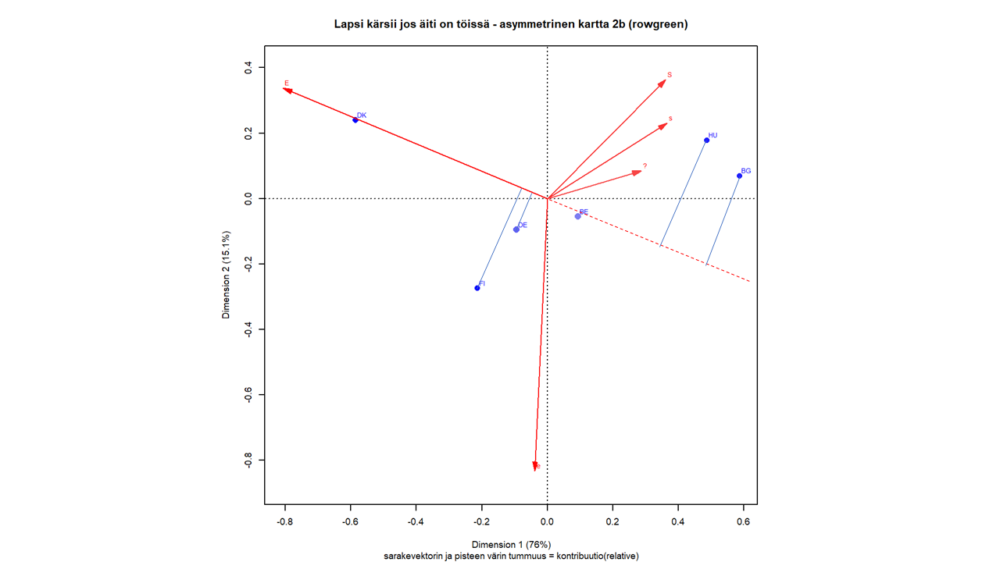

# Tulkinnan perusteita

```{r paketit-g13,eval = FALSE, include=FALSE}
# Paketit 1.2.20, kommentoin pois ne joita ei ole käytetty (likert, stargazer)
library(rgl)
library(ca)
library(haven)
library(dplyr)
library(knitr)
library(tidyverse)
library(lubridate)
library(rmarkdown)
library(ggplot2)
library(furniture)
# library(likert) # ei käytetty(1.2.20)
library(scales) # G_1_2 - kuva
library(reshape2)  # G_1_2 - kuva
library(printr) #19.5.18 taulukoiden ja matriisien tulostukseen
# library(stargazer) # 28.5.2018 taulukoiden yms. tulostukseen,ei käytetty(1.2.20)

#Uusia 13.6.2018
library(bookdown)
library(tinytex)
# Uusia 1/2020
library(assertthat)
# library(testthat) #ei käytetä (7.10.20)
#

# sessionInfo()

```
Luvussa syvennetään esimerkin tulkinnan perusteita. Miksi symmetrinen kartta on yleensä paras vaihtoehto,
siksi se oletusarvoisesti esitetäänkin. Milloin voi käyttää vaihtoehtoisia esitystapoja? **Ydinluku**.

**Tärkein asia** CA:ssa kaikki on suhteellista

**Tärkeä asia 1** Symmetrinen kuva, kaksi pistepilveä samassa koordinaatistossa.
**Tärkeä asia 2** Rivi- ja sarakeratkaisun duaalisuus (vai käsitelläänkö jo johdattelevassa esimerkissä?)

Esimerkkiaineistossa tulee jo pohdittavaa, Guttman (arc, horseshoe) - efekti, ratkaisun dimensiot jne.

Asymmetrinen kartta, jossa riviprofiilit ovat pääkomponentti-koordinaateissa ja sarakeprofiilit standardikoordinaateissa.

(@) Sarakkeet ideaalipisteinä, edustavat kuvittellisia maita joissa kaikki ovat vastanneet vain yhdellä tavalla. Sarakepisteet ovat barysentrisen koordinaatisto akseleita.

(@) Sarakepisteet kaukana origosta, koska skaalattu ja

(@) Rivipisteet kasautuneet keskiarvopisteen ympärille. Symmetrinen kuva on usein hyvä oletus tästä syystä.

(@) Rivi-ja sarakepisteiden suhteelliset sijannit samat kuin symmetrisessä kuvassa

(@) Tässäkin kuvassa pisteen koko kuvaa sen massaa. Sarakkeista "täysin samaa mieltä" (ts) ja "ei samaa eikä eri mieltä" ovat massoiltaan pienimmät.


```{r G1-3asymm1, eval=FALSE, include=FALSE}

# asymmetrinen kartta - rivit pc ja sarakkeet sc
#  (19.2.20) Käytetään "nuoliversiota"- tämä passiiviseksi
# HUOM! simpleCA1 luodaan G1_2_johdesim.Rmd - tiedostossa
par(cex = 0.6)
plot(simpleCA1, map = "rowprincipal", 
     mass = c(TRUE,TRUE),
     main = "Lapsi kärsii jos äiti on töissä -asymmetrinen kartta" )

```

Tarinaa voi tarvittaessa jatkaa, tämä on CA:n hankalin asia. Kaksi koordinaatistoa, ja niiden yhteys.

(@) Asymmetrinen kuva ja akseleiden / dimensioiden tulkinta

Piirretään sama asymmetrinen kartta uudelleen, mutta yhdistetään sarakepisteet keskiarvopisteeseen (sentroidiin) suorilla. Mitä terävämpi on sarakesuoran (vektorin?) ja akselin kulma, sitä enemmän sarake määrittää tätä ulottuvuutta. Jos vektori on lähettä 45 asteen kulmaa, sarake määrittää yhtä paljon molempia ulottuvuuksia. **#V lähde?**

Standardikooridaateissa esitety sarakepisteet ovat fiktiivisiä "maapisteitä", joissa
kaikki vastaukset ovat yhdessä luokittelumuuttujan arvossa.Alkuperäisessä täydessä avaruudessa
ne ovat simpleksin kärkipisteet, simpleksin sisällä ovat riviprofiilit.
     
```{r G1-3asymm2,fig.cap= "Q1b: lapsi kärsii jos äiti on töissä",fig.asp = 1, out.width = "90%",fig.align = "center"}

# asymmetrinen kartta - rivit pc ja sarakkeet sc
# sarakkeet vektorikuvina
# HUOM! simpleCA1 luodaan G1_2_johdesim.Rmd - tiedostossa
#
#
# 
# Kuva tiedostoon - ennen plot-komentoa avataan tiedosto
# pdf("img/sCA1asymm1.pdf")
par(cex = 0.6)
plot(simpleCA1, map = "rowprincipal", 
     arrows = c(FALSE,TRUE), 
     # main = "Lapsi kärsii jos äiti on töissä -asymmetrinen kartta 1
     sub = "asymmetrinen kartta")
# Kuva tiedostoon - suljetaan
# dev.off()

```

Sarakkeen "Eri mieltä" (e) määrittää toisen ulottuvuuden, jonka voisi tulkita 
erottelevan "maltilliset" mielipiteen tiukemmista. Sarake "täysin samaa mieltä" 
(S) määrittää toista ulottuvuutta lähes yhtä paljon kuin ensimmäistä, mutta "täysin 
eri mieltä" (E) on vasemmalla ja kolme vastausvaihtoehtoa oikealla. Kovin terävästi
dimensiot eivät eroa toisistaan?

Asymmetrinen kartta - rivipisteet (profiilit) sarakepisteiden standardikoordinaattien 
keskiarvopisteinä (ns. barysentrinen keskiarvo).

```{r G1-3asymm3,fig.cap= "Q1b: lapsi kärsii jos äiti on töissä",fig.asp = 1, out.width = "90%",fig.align = "center"}
# Barysentrisen keskiarvon  "viivakuviota" kehitelty CA_calc1.R - skriptissä
# simpleCA1-objektista saa std-koordinaatit, muunnoksella rivien pääkoordinaatit
# rpc.

# Jos plot-komennotoon "MapObj1 <- ", saadaan pisteiden koordinaatit
# plot-funktiolla ensin "raamit" ja pisteet talteen, sitten pisteet Suomen
# pisteestä lines(x,y) sarakevektoreihin? (29.5.20)


# asymmetrinen kartta - rivit pc ja sarakkeet sc
# sarakkeet vektorikuvina
# HUOM! simpleCA1 luodaan G1_2_johdesim.Rmd - tiedostossa

# Kuva tiedostoon - ennen plot-komentoa avataan tiedosto
# pdf("img/sCA1asymm1.pdf") ja lopuksi suljetaan tiedosto

# Piirretään Suomen riviprofiilista janat sarakepisteisiin - barysentinen keskiarvo
# Rivipisteet pääkoordinaatteina (principal coordinates)

simpleCA1.rpc <- simpleCA1$rowcoord %*% diag(simpleCA1$sv)

# X11()
par(cex = 0.6)
plot(simpleCA1, map = "rowprincipal", 
     arrows = c(FALSE,FALSE),
     # main = "Lapsi kärsii jos äiti on töissä -asymmetrinen kartta 2",
     sub = "Suomen profiili sarakkeiden barysentrisenä keskiarvona")
     segments(simpleCA1.rpc[5,1],simpleCA1.rpc[5,2],simpleCA1$colcoord[, 1],
         simpleCA1$colcoord[, 2], col = "pink")
     
# Kuva tiedostoon - suljetaan
# dev.off()


```

**Edit 3.5.20** Selvennä: sarakevektroit ovat standardikoordinaateissa, 
ideaalipisteitä ("maa jossa kaikki samaa mieltä"). Miksi ne ovat kartalla 
"reilusti" ykköstä suurempia? Vastaus: ideaalipisteet esitetään rivipisteiden 
koordinaatistossa - > skaalaus.

**Edit 11.6.20 - tulkinta ja data?TARKISTA** Origo on koko aineiston barysentrinen
keskipiste. Janan pituus on kääntäen verrannollinen sarakkeen ("ideaalipisteen")
suhteelliseen osuuteen. Maapiste (profiilipiste) on saravektoreiden barysentrinen
keskiarvo, ja etäisyydet kertovat kyseisen sarakkeen suhteellisen osuuden
maaprofiliisissa.(? 11.6.20).
" In an asymmetric map where the rows, for example, are in principal co-
ordinates (i.e. the row analysis), distances between displayed row points
are approximate khii2-distances between row profiles; and distances from the
row profile points to a column vertex point are, as a general rule, inversely
related to the row profile elements for that column." CAiP, s. 72., tarkemmin s.62-.
Pisteiden väliset etäisyydet voidaan optimaalisessa tilanteessa (symm. kuva sama
pistejoukko, asymm. kuva myös sarake- ja rivipisteet) tulkita vain
approksimaatioina.

Verifying the profile-vertex interpretation (emt., s 68):
Each row profile point (staff group) is at a weighted average position of the
column vertex points (smoking categories), where the weights are the elements
of the respective row profile. As a general rule, assuming that the display
is of good quality, which is true in this case, the closer a profile is to that
vertex, the higher its profie value is for that category.

Verifiointi verteksi kerrallaan, kaikki on suhteellista! Suomi on kaikkein lähimpänä
e-verteksiä. Niinpä Suomen profiilissa e-vastausten suhteellinen osuus on suurempi kuin 
muilla mailla. Tanska vastaavasti lähimpänä E-verteksiä. Projisoidaan rivipisteet
sarakevektoreille -> järjestys. **todo 10.10.20** Tarkista tämä tulkinta!

Perusidea: kartta antaa yleiskuvan riippuvuudesta, approksimaation tarkkuuden ja
laadun rajoissa. Yksityiskohtien etsiskely ei ole oleellista, väärien johtopäätösten
välttäminen on. Erityisesti symmetrisessä kartassa ei voi tulkita mitenkään (tiukasti
ottaen) eri pistejoukkojen etäisyyksiä. Ei voi tunnistaa klustereita!

**edit 14.8.20** Barysentrinen koordinaatisto on ideaalipisteiden simpleksin 
kärkipisteiden koordinaatisto.


```{r G1-3asymmContrib1,fig.cap= "Q1b: lapsi kärsii jos äiti on töissä",fig.asp = 1, out.width = "90%",fig.align = "center"}
# X11() komentoriville ja plot-komento -> grafiikkaikkuna
par(cex = 0.6)
plot(simpleCA1, map = "rowgreen",
     contrib = c("absolute", "absolute"),
     mass = c(TRUE,TRUE),
     arrows = c(FALSE, TRUE),
     main = "Lapsi kärsii jos äiti on töissä - asymmetrinen kartta 2a (rowgreen)",
     sub = "sarakevektorin ja rivipisteiden värin tummuus = kontribuutio(absolute)")

```


Greenacre (2006, "loose ends -artikkeli") ehdotti asymmetrisessä kuvassa 
standardikoordinaattien skaalaamista niin, että ne kerrotaan massan neliöjuurella. 
Tämä skaalaus toimii hyvin pienen ja suuren inertian tapauksessa. Kartoissa pätee 
sama sääntö kuin muussakin graafisessa data-analyyisissä, kuvien on esitettävä 
oleelliset yhteydet, mutta mielellään vain ne.**todo 10.10.20** Inertian maksimi
on ratkaisun dimensioiden suurin lukumäärä. **teoria-jaksoon.**

Sama kuva, kontribuutiot "relative". **edit 24.2.20** Ero selitettävä!

```{r G1-3asymmContrib2,fig.cap= "Q1b: lapsi kärsii jos äiti on töissä",fig.asp = 1, out.width = "90%",fig.align = "center"}
#X11() komentoriville ja plot-komento
par(cex = 0.6)
plot(simpleCA1, map = "rowgreen",
     contrib = c("relative", "relative"),
     mass = c(TRUE,TRUE),
     arrows = c(FALSE, TRUE),
     main = "Lapsi kärsii jos äiti on töissä - asymmetrinen kartta 2b (rowgreen)",
     sub = "sarakevektorin ja pisteen värin tummuus = kontribuutio(relative)")

```
Asymmetrisessä kartassa 2 pisteiden koko on suhteessa niiden massaan, ja 
värisävy absoluuttiseen tai suhteelliseen kontribuutioon.

Sarakevektorin kulma akseliin - mitä pienempi sitä enemmän määrittää. Jos lähellä
45 asteen lävistäjää, kontribuutiota on molempiin akseleihin

**Tulkinta: rivipisteiden ortogonaalinen projektio "sarakevektorille"**

Rivipisteet voidaan projisoida ortogonaalisesti sarakevektorille
ja sen pisteillä merkitylle jatkeelle. Järjestys on sama kuin sarakkeen modaliteetin
suhteellinen osuus rivipisteen profiilissa. Ensimmäisessä kartassa on käsivaralla
piirretty suurinpiirtein kohtisuorat projektiot lievempää erimielisyyttä edustavalle
s- ideaalipisteeseen (0,1,0,0,0) origosta piirretylle suoralle.

**Onko näin? (17.9.20)** Toisessa kuvassa sama E-vektorille. Maiden suhteellinen
järjestys on oikea, mutta tarkasti etäisyydet eivät (välimatka-asteikolla)
ole vertailukelpoisia. Kartta on approksimaatio. Asymmetrinen kartta on kuitenkin
kaksoiskuva (biplot).

Vertailun vuoksi riviprofiilien sarakkeita vastavat arvot suuruusjärjestyksessä:

e:   FI 38, DE 31, BE 27, BG 21, HU 19, DK 17 (%-yksikköä)

**todo 15.9.20** Voiko tämän tehdä myös skaalatulle (rowgreen) asymmetriselle kuvalle?


```{r G1_3_asymmtulk1, out.width='90%', fig.align='center'}


```
E:  DK 50, FI 27, DE 26,  BE 19, HU 8, BG 1 (%-yksiköä)

```{r G1_3_asymmtulk2, out.width='90%', fig.align='center'}



```

**"kaikki on suhteellista"** Esimerkiksi Tanskan riviprofiilissa 
E-vastauksien suhteellinen osuus poikkeaa eniten keskiarvopisteestä (origossa).
Asymmetisessä kuvassa voimme projisoida rivipisteet sarakepisteen vektorille.

Korrespondenssianalyysin ratkaisun yksityiskohdat: ca-funkton tuloste ja "tulosobjekti".
**Tulosobjekti "teoriajaksoon", vai viitataako siellä tähän kohtaan?**

Numeeriset tulokset, jälkimmäisessä rivimassat vakioitu yhtä suuriksi
("riviprofiilitaulukon ca").


```{r G1_3_castats1}
# CA:n numeeriset tulokset
# (11.4.20) yhdistä koodilohkoon khii2dist1 (G1_2_johdesim.Rmd, r. 665)
# CA:n numeeristen tulosten käsittelyä myös CAcalc_1.R -skriptissä.

summary(simpleCA1)

# vertailun vuoksi numeeriset tulokset, kun maiden massat vakiot
summary(simpleCA3)

# Rivi- ja sarake-etäisyydet (keskiarvosta/sentroidista)
# HUOM! Edellisessä jaksossa taulukko rivi- ja sarake-etäisyyksistä. Tuskin
# kannattaa tässä toistaa. Muuta analyysiä numeerisista tuloksista. (10.4.20)

# simpleCA1$rownames
# simpleCA1$rowdist
# simpleCA3$rowdist

# simpleCA1$colnames
# simpleCA1$coldist
# simpleCA3$coldist

# Hieman laskentaa

# Massojen summat 1 - onko ero ca-tulosten massoissa pyöristysvirhe? (17.10.20)
#sum(simpleCA1$colmass)
#sum(simpleCA3$colmass)
#testMassDiff <- simpleCA3$colmass - simpleCA1$colmass
#testMassDiff
# 0.005812145  0.012608847  0.002977493 -0.005426916 -0.015971569

```

**edit**Edellisessä jaksossa esimerkki siistimmästä taulukosta,samoin
bookdown-testiprojektissa.

Tulkinta:
- ensin ratkaisu alkuperäisillä massoilla (otoskoot), sitten vertaillaan
ratkaisuun vakiomassoilla -> massojen vaikutus.

1. Pääakselien inertiat - ratkaisun yleinen laatu (ne prosentit kuvissa!)

- maksimi-inertia (teoreettinen) on 4, yleisesti min(J-1, K-1), J on rivien ja K sarakkeiden
lukumäärä

- alkuperäisten "pistepilvien" inertia jaetaan ca-ratkaisussa pääakseleille
suurimmasta pienimpään (esim. Rows:inr - sarakkeen summa on 1)

- kokonaisinertia 0.18 (vertailu teoreettiseen maksimiin ei kovin kiinnostava?)
- ensimmäinen akseli ei täysin dominoi, mutta kaksi ensimmäistä kuvaavat jo 91 prosenttia
aineiston kokonaishajonnasta (käytän termejä hajonta ja inertia vaihtelevasti)
- 9 prosenttia jää kuitenkin 3. ja 4. dimensiolle

2. Kartta tulkitaan katseella - numeerisista tuloksista tarkistetaan
ja varmistetaan

Mitä on vasemmalla ja oikealla (1. dimensio 76 % inertiasta), ylhäällä ja
alhaalla (15 % inertiasta) - > sarakkeet ja niiden avulla akselien tulkinta
(etäisyydet appr. khii2).

Pisteet ja niiden (suhteellinen sijanti) origoon ja toisiinsa ( samassa pilvessä)
appr. khii2 jos kvalitetti kelvollinen. Muuten "lähellä voi olla kaukana", kaukana
on kuitenkin aika kaukana.

Numeerista tuloksista katsotaan:

**Sarakkeet** ja akseleiden tulkinnan tarkistus (ensin):


1. Kvalitetti kaikilla ok (>785): sarakkeet ja niiden etäisyydet hyvin esitetty

2. Sarakkeiden osuudet kokonaisinertiasta: E-sarake yli puolet (524), eos-sarake
pienin (73).

3. Akselien tulkinnan varmistaminen (pääakselit ja koordinaatit), koordinaattien
suunta (+ vai -)

**cor**: relative contributions (out of 1000) of each dimension to the inertia of
individual points. These are also interpreted as squared correlations (1000)

CA-ratkaisun ulottuvuuksien (yleensä 2) suhteellinen kontribuution pisteen
inertialle; kuinka "kaukana" tai "lähellä" piste on akseleiden määrämäästä tasosta?
CA-ratkaisu minimoi massoilla painotetut poikkeamat.

cor1 + cor2 = qlt

**ctr**: contributions (out of 1000) of each point to the principal inertia of a
dimension - pisteen suhteellinen kontribuutio akselin (pää) inertialle. Huom!
suhteellinen, akselin osuus pilven inertiasta huomioitava.

**ensimmäinen akseli** (76% kokonaisinertiasta); E "tasossa kiinni" (cor=966) ja
osuus akselin kontribuutiosta yli puolet (651), koordinaatin etumerkistä näkyy suunta (-).
- oikealle (+) S ja s yht neljännes (265), eos("?") hieman ja e mitään (2)
- ensimmäinen akseli "selittää" kaikkien muiden pisteiden inertiasta suurimman
osan, e poikkeus (cor 11)

- hyvin selkeä, visuaalinen tulkinta on oikea
E vasemmalla - kontrastina oikealla S ja s, eos-kategoria hieman.

**toinen akseli** (15% kokonaisinertiasta): e "tasossa kiinni" (cor 971) ja
osuus akselin inertiasta n. 70% (mutta akselin osuus kokonaisinertiasta 15%),
suunta (-). eos ei vaikuta akseliin(ctr 7) eikä akseli eos-pisteen inertiaan(cor.

Positiiviseen suuntaan akselin inertiaan vaikuttavat tiukat mielipiteet E
(ctr 114) ja S (ctr 132), s jonkin verran (53)

Maltillinen "eri mieltä" määrittää yksin toisen dimension, hieman yllättäen
neutraalilla (eos) vaihtoehdolla ei ole yhteyttä dimensioon. Sen ainoa vaikutus
ratkaisuun (kun inertia näin dekomponoidaan) on pieni S-suuntaan ensimmäisellä
akselilla.


ctr/cor - epäsymmetrinen suhde (teoriajaksoon).


**Rivit** 

1. kvaliteeetti (qlt): onko joku piste huonosti edustettu ratkaisussa
(projektiossa)?

- Belgia qlt kehnoin, Saksan toiseksi kehnoin. Belgialla suurin massa, Saksalla
toiseksi suurin, ja silti niiden vaikutus karttaan (ctr molemmille akseleille)
on heikko

2. inr: part of total inertia of the point in the full space (rows or columns)

- pisteen suhteellinen osuus (1000) koko alkuperäisen pilven inertiasta
- DK suurin (381), BG ja HU lähes puolet (yht. 457), kolme muuta yhteensä 16 %
- taas hämmentää Saksan ja Belgian pieni osuus kokonaisinertiasta
- vai onko seuraus siitä, että massa molemmilla suuri?
Lähellä aineiston keskiarvopistettä? Tämä nähdään kun verrataan CA-ratkaisuun
jossa mailla sama paino!


**Vertailu vakioitujen rivimassojen ca-ratkaisuun**


1. Tätä voisi käyttää esimerkkinä numeeristen tulosten vertailussa?

2. Kokonaisinertia kasvaa (0,18 -> 0,22), koordinaatisto muuttuu
mutta ei kovin radikaalisti.

3. Kvaliteetti, kontribuutiot? Miten vertailla oleellisia asioita?

Belgian laatu putoavaa,ja kontribuutiot pienenevät entisestään.

Saksan laatu paranee aika paljon, ja kontribuutiotkin jonkin verran.
Aika outoa,että suurimman massan maiden (DE,BE lähes puolet datasta)
kontribuutiot ovat niin pieniä (24.2.20).

Saksa siirtyy x-akselilla vasemmalle (x-koordinaatti -94 -> -144). Belgia siiryy
x-akselilla lähemmäs origoa (93 -> 46) ja y-akselilla vähän kauemmas. Eihän tässä
näin pitänyt käydä!

Kuvasta näkee muutoksen vähäisyyden. Aineisto on pieni, mutta kuva on selvästi
tehokkaampi tapa kuvata taulukon rivien ja sarakkeiden yhteyksiä.

4. **Sarakemassojen muutos?** Kaavaliitteessä eksplisiittisesti rivi-
ja sarakeratkaisujen yhteys, massat mukana. Sarake- ja rivmassojen summat ovat 1.
Sarekemassat ja inr muuttuvat hieman. Onko pyöristysvirhettä?

