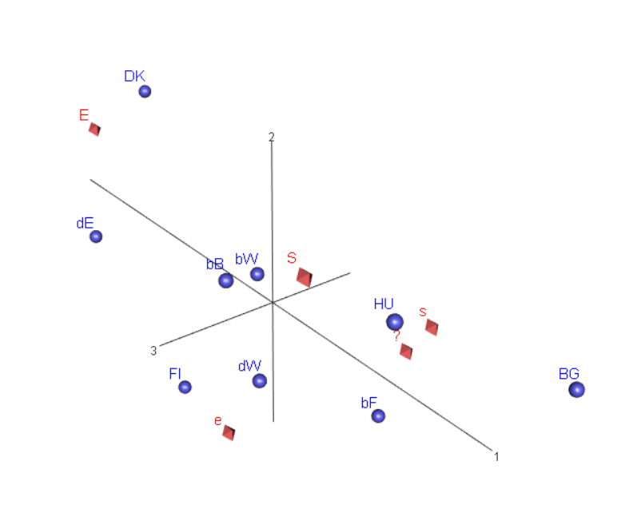
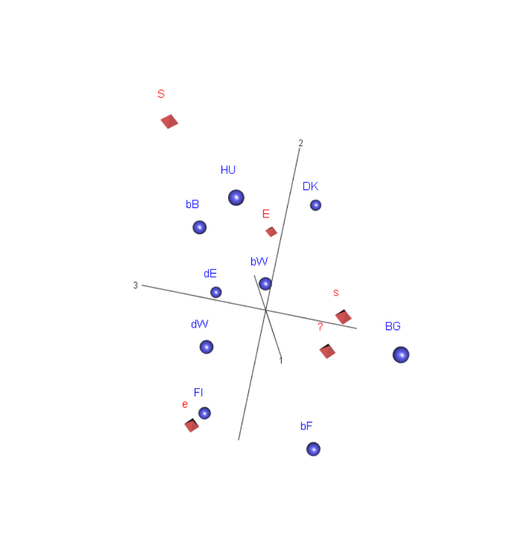

# Yksinkertaisen korrespondenssianalyysin laajennuksia 1

```{r paketit-g14,eval = FALSE, include = FALSE}
# Paketit 1.2.20, kommentoin pois ne joita ei ole käytetty (likert, stargazer)
library(rgl)
library(ca)
library(haven)
library(dplyr)
library(knitr)
library(tidyverse)
library(lubridate)
library(rmarkdown)
library(ggplot2)
library(furniture)
# library(likert) # ei käytetty(1.2.20)
library(scales) # G_1_2 - kuva
library(reshape2)  # G_1_2 - kuva
library(printr) #19.5.18 taulukoiden ja matriisien tulostukseen
# library(stargazer) # 28.5.2018 taulukoiden yms. tulostukseen,ei käytetty(1.2.20)

#Uusia 13.6.2018
library(bookdown)
library(tinytex)
# Uusia 1/2020
library(assertthat)
#library(testthat)
#
#r-skripteillä riittää, kun ajaa tämän
#sessionInfo()

```

Korrespondenssianalyysi sallii rivien tai sarakkeiden yhdistelyn tai
"jakamisen". Tämä onnistuu esimerkkiaineistossa lisäämällä rivejä eli jakamalla
eri maiden vastausksia useampaan ryhmään. Kartalle voidaan myös lisätä apumuuttujia
tai täydentäviä muuttujia (supplementary points). Ne eivät vaikuta ca:n tuloksiin,
vaan esittävät lisäinformaatiota.

**edit 9.9.20 - vähän vanhentunuttta**Sen avulla voi myös tarkastella ja
vertailla erilaisia ryhmien välisiä tai ryhmien sisäisiä (within groups -
between groups) eroja hieman. Teknisesti yksinkertaista korrespondenssianalyysiä
sovelletaan muokattuun matriisiin. Datamatriisi rakennetaan useammasta
alimatriisista, joko "pinoamalla" osamatriiseja (stacked matrices) tai
muodostamalla symmetrinen lohkomatriisi (ABBA).

**edit 9.9.20 Uusi johdanto**
1. Saksan ja Belgian jako

- jakaumaekvivalenssi(?) (distributional equivalence)), voidaan jakaa ja yhdistää
rivejä
- Belgia leviää pystysuuntaan, Saksa vaakasuuntaan

```{r G1-4-BeDeSplit, fig.cap = "Belgian ja Saksan aluejako",fig.asp = 1, out.width = "90%",fig.align = "center"}
# HUOM! Tässä ei vielä supp.points mukana!
par(cex = 0.6)
suppointCA1 <- ca(~maa3 + Q1b,ISSP2012esim1.dat)
plot(suppointCA1, main = "Belgian ja Saksan ositteet",
                sub = "symmetrinen kartta")

```

2. Täydentävät pistee (supplementary points)
 
 - eivät vaikuta karttaan (koordinaatistoon, rivi- tai sarakepisteiden sijaintiin)
 - useita tapoja käyttää, tässä Saksan ja Belgian maapisteet
 - barysentrinen keskiarvo

3. Lisämuuttujat - yksinkertainen ca useamman muuttujan analyysissä

3.1 Yksinkeraisin malli: vuorovaikutusmuuttuja (interactive coding)
- yksi rivi (sample) jaetaan useammaksi, sama idea kuin edellisessä esimerkissä
- käytännön raja yleensä kolmen muuttujan vuorovaikutusmuuttuja, esimerkkinä maan,
iän ja sukupuolen yhdistetty muuttuja

3.2 Kartta on data-analyysin väline - miten sitä voi selkeyttää?

Hyvässä kartassa on vain tarpeellinen määrä informaatiota, epäselvä tukkoinen kuva
ei toimi. Yksinkertainen keino analyysivaiheessa on "leikata ja liimata" kuvia ja
tallentaa ne pdf-muodossa. Voi tehdä muistiinpanoja, lisätä kommentteja jne.

Tässä esitellään kaksi muuta: kuva-alan rajaaminen BaseR-grafiikan plot-funktion
parametreilla ja paljon yleispätevämpi osajoukon korrespondenssianalyysi. 
Jälkimmäisessä valitaan joku osajoukko aineistosta, ja tehdään sille 
korrespondenssianalyysi siten, että reunajakaumat (massat) ja valitun datan 
profiilit pidetään vakioina. Paljon parempi idea kuin suoraviivainen aineiston
rajaaminen.

Nyt käytetään johdattelevan esimerkin dataa, johon muunnokset on jo alustavasti 
tehty.

**(14.9.20)**G1_4_CAlaaj1.Rmd jaettu kolmeksi tiedostoksi, uusia G1_4_CAlaaj2.Rmd ja
G1_4_CAlaaj3.Rmd

**Vanhaa koodia kolme koodilohkoa**
```{r G1_4_CAlaaj1DataOLD, eval=FALSE, include=FALSE}

# Saksan ja Belgian aluejako - täydentävät pisteet

# EI KAI KOKO DATAA LUETA ALUSTA ALKAEN UUDESTAAN?? (2.2.20)
# ISSP2012esim1.data <- read_spss("data/ZA5900_v4-0-0.sav") # Alkuperäinen data, ( user_na = TRUE pois 25.9.2018)

#str(ISSP2012esim1.data) 
#61754 obs. of  420 variables
#
# VAHAA KOODIA
#
# KUUSI MAATA
#
# incl_esim1 <- c(56, 100, 208, 246, 276, 348) #BE,BG,DK,FI,DE,HU)

# ISSP2012esim1.dat <- filter(ISSP2012esim1.data, V4 %in% incl_esim1) 

# str(ISSP2012esim1.dat) #8557 obs. of  420 variables
#
# mukaan muuttujat, V3 jos halutaan jakaa Saksa ja Belgia
# SEX 1=male, 2=female AGE haastateltava ikä haastatteluhetkellä

# MUUTTUJAT

#ISSP2012esim1.dat <- select(ISSP2012esim1.dat, C_ALPHAN, V3,V4, V6, SEX, AGE) 

#str(ISSP2012esim1.dat) #8557 obs. of  6 variables
#
# Poistetaan havainnot, joissa puuttuvia tietoja

#ISSP2012esim1.dat <- filter(ISSP2012esim1.dat, (!is.na(V6) & !is.na(SEX) & !is.na(AGE)))

#str(ISSP2012esim1.dat) #8143 havaintoa, 6 muuttujaa
#8557-8143 = 414 havaintoa vähemmän

# sp (sukupuoli) m = 1, f = 2
#sp_labels <- c("m","f")
#
# vastausvaihtoehdot
#
# 1 = täysin samaa mieltä, 2 = samaa mieltä, 3 = ei samaa eikä eri, 4 = eri mieltä, 5 = täysin eri mieltä
# vastaus_labels <- c("S","s","?","e","E")

# Faktoreiksi - onko ihan oikein? On(26.9.18) - faktoroitu uudeksi muuttujaksi, vanhassa säilyvät metatiedot (10.10.18)

# ISSP2012esim1.dat$maa <- factor(ISSP2012esim1.dat$C_ALPHAN)
#ISSP2012esim1.dat$sp <- factor(ISSP2012esim1.dat$SEX, labels = sp_labels) #pitäisikö lisätä levels?
#ISSP2012esim1.dat$Q1b <- factor(ISSP2012esim1.dat$V6, labels = vastaus_labels) #pitäisikö lisätä levels?
#str(ISSP2012esim1.dat)
#str(ISSP2012esim1.dat$sp)
#summary(ISSP2012esim1.dat)
#ISSP2012esim1.dat %>% tableX(sp, V6, type = "row_perc")
```

```{r G1_4_CAlaaj1Data, eval=FALSE, include=FALSE}
# Uusi data, luotu G1_2_johdesim.Rmd - jaksossa - ei kuvailuja enään tähän (19.2.20)
str(ISSP2012esim1.dat)
```

```{r G1_4_maa2OLD, eval=FALSE, include=FALSE}
# HUOM! Nyt maa3 (3.2.20)

# 23.5.2018 maa2 - muuttuja / NYT maa3 (3.2.20)
# ISO 3166 Code kansallisvaltiolle muuttujassa V4 (EI, V4 on whole nation states! 3.2.20)
#
# ISO 3166 Code V3 - maiden jaot
#  5601     BE-FLA-Belgium/ Flanders
#  5602     BE-WAL-Belgium/ Wallonia
#  5603     BE-BRU-Belgium/ Brussels
# 27601     DE-W-Germany-West
# 27602     DE-E-Germany-East
# ISSP2012esim1.dat$maa2 <- factor(ISSP2012esim1.dat$V3, 
#                  levels = c("100","208","246","348","5601","5602","5603","27601","27602"),
#                  labels = c("BG","DK","FI","HU","bF","bW","bB","dW","dE"))

#head(ISSP2012esim1.dat)
#str(ISSP2012esim1.dat$maa2)
#taulu41 <- ISSP2012esim1.dat %>% tableX(maa,maa2,type = "count") # Tarkistus maa2-muuttujalle
#kable(taulu41,digits = 2, caption = "Uusi muuttuja maa2: Belgian ja Saksan ositus")

```


## Täydentävät muuttujat (supplementary points)

**zxy** Piste sinne piirretään, mutta muuttujassa on se tieto.
"Täydentävä piste" kuulostaa huonolta. Lisämuuttujat, havainnot, lisäpisteet?

**Viite:CAip ss 89, HY2017_MCA.**

Aineistossa on havaintoja (rivejä) tai muuttujia (sarakkeita), joista voi olla
hyötyä tulosten tulkinnassa. Nämä lisäpisteet voidaan sijoittaa kartalle, jos
niitä voidaan jotenkin järkevästi vertailla kartan luomisessa käytettyihin
profiileihin (riveihin ja sarakkeisiin). 

**EDIT** Lisätään Belgian ja Saksan aluejako täydentäviksi riveiksi. Sopii
tarinaan, dimensioiden tulkinta ei ollut esimerkissä kovin kirkas. Viite CAip:n
lukuun, jossa vain todetaan että maita ei ole järkevää painottaa (massa)
otoskoolla, vaan vakioidaan (jotenkin) sama (suhteellinen) massa kaikille.
Samalla oikaistaan myös naisten yliedustus aineistossa.

**Käsitteitä:** 
(a) Active point, aktiivinen piste (aktiivinen havainto tai
muuttuja).

(b) Supplementary pointtäydentävä piste (täydentävä havainto).

Täydentävien muuttujien kolme käyttötapaa:

1. Sisällöllisesti tutkimusongelman kannalta poikkeava tai erilainen rivi tai
sarake

2. Outlayerit, poikkeava havainto jolla pieni massa (esimerkissä uusi
sarakemuuttuja, jossa kovin vähän havaintoja)

3.  osaryhmät
**EDIT** capaper- jäsentelyssä ja bookdown-dokumentissa selitetetty 
täydentävät/lisäpisteet tarkemmin (18.9.2018).

```{r G1-4suppoints-BeDe, fig.cap = "Belgian ja Saksan aluejako",fig.asp = 1, out.width = "90%",fig.align = "center"}

# Kömpelöä koodia, harjoitellaan taulukoiden yhdistelyä (CAtest1.Rmd)
# Belgian ja Sakasan jako lisäpisteinä 24.5.2018
# Data suppointCA1


# Miten lisärivit? (24.5.2018)
# Luetaan data tauluksi - ei toimi, char-table.Toimisiko nyt, ei chr? (4.2.20)
# yritetään uudestaan table-funktiolla

# data maa3-muuttujassa
# str(ISSP2012esim1.dat$maa3)
# attributes(ISSP2012esim1.dat$maa3)

suppoint1_df1 <- select(ISSP2012esim1.dat, maa3,Q1b)

#  tarkistuksiin jos koodi suoritetaan rivi kerrallaan
# str(suppoint1_tab1)

suppoint1_tab1 <- table(suppoint1_df1$maa3, suppoint1_df1$Q1b)
suppoint1_tab1 
#plot(ca(~maa2 + V6, suppoint1_df1)) #toimii
#
# Saksan ja Belgian summarivit
#
suppoint2_df <- filter(ISSP2012esim1.dat, (maa == "BE" | maa == "DE"))
suppoint2_df <- select(suppoint2_df, maa, Q1b)
#head(suppoint2_df)
#tail(suppoint2_df)
str(suppoint2_df)
# attributes(suppoint2_df) # korvaa attr(x, which) tms. liian pitkä tulostus
# attr(suppoint2_df, which = "class")
# attr(suppoint2_df, which = "name")
# summary(suppoint2_df)
suppoint2_df %>% table1()
suppoint2_tab1 <- table(suppoint2_df$maa, suppoint2_df$Q1b)
# suppoint2_tab1 # tarkistus
suppoint2_tab1 <- suppoint2_tab1[-2,]
# kömpelösti kolme kertaa
suppoint2_tab1 <- suppoint2_tab1[-3,]
suppoint2_tab1 <- suppoint2_tab1[-3,]
suppoint2_tab1 <- suppoint2_tab1[-3,]

# suppoint2_tab1 # Belgian ja Saksan summat yli ositteiden
suppoint2_tab1
#lisätään rivit maa3-muuttujan taulukkoon

suppoint1_tab1 <- rbind(suppoint1_tab1, suppoint2_tab1)
suppoint1_tab1
suppointCA2 <- ca(suppoint1_tab1[,1:5], suprow = 10:11)
par(cex = 0.6)
plot(suppointCA2, main = "Symmetrinen kartta: Saksan(2) Belgian(3) aluejako",
     sub = "Passiiviset pisteet DE ja BE" )

```
Kääntöä ei tarvita, kun maiden järjestys on sama myös muuttujassa maa3
(mukana maiden jaot).

Saksan ja Belgian summarivit ovat ositteiden painotettuja keskiarvoja
(sentroideja), esim.läntisen ja itäisen Saksan rivipisteiden välisellä janalla
on koko maan summapiste DE.

**18.9.20** Hajonta kasvaa, ja kartan oikealla puolella sarakkeiden etäisyydet
kasvavat. Erityisest S-piste nousee toisen dimension suuntaan ylöspäin. Muiden
maiden pisteet eivät juuri muuta suhteellisia sijaintejaan, mutta "Belgia leviää
pystysuuntaan ja Saksa vaakasuuntaan." Bryssel (bB) ja Flanders (bF) ovan
konservatiivisempiä kuin lievästi liberaalimpi Wallonia (bW). Flandersin ja
Brysselin ero on mielipiteen varmuudessa tai tiukkuudussa, ja Bryssel saattaa olla
polarisoitunut (lievä Guttman-efekti).
```{r suppoint-rprof1}
# riviprofiilitaulukko joteskin (18.9.20)
ISSP2012esim1.dat %>% tableX(maa3, Q1b, type = "row_perc")

```


Piirretään vertailun vuoksi vielä asymmetrinen kartta ("kontribuutio-kartta, kontribuutio-kaksoiskuva"). 
**edit 3.5.20** Minne katoavat pisteet, outoa?

```{r G1-4-BeDe-asymmContrib1a, fig.cap = "Belgian ja Saksan aluejako",fig.asp = 1, out.width = "90%",fig.align = "center"}
par(cex = 0.6)
plot(suppointCA2, map = "rowgreen",
     contrib = c("absolute", "absolute"),
     mass = c(TRUE,TRUE),
     arrows = c(FALSE, TRUE),
     main = "Saksan ja Belgian alueet - asymmetrinen kartta 1",
     sub = "kontribuutiokartta (rowgreen, absolute)")

```

Maapisteet täydentävinä pisteinä

```{r r G1-4-BeDe-asymmContrib1b, fig.cap = "Belgian ja Saksan aluejako",fig.asp = 1, out.width = "90%",fig.align = "center"}
# Sama kuva, maasummat lisäpisteinä (4.2.20)
par(cex = 0.6)
plot(suppointCA2, map = "rowgreen",
     contrib = c("relative", "relative"),
     mass = c(TRUE,TRUE),
     arrows = c(FALSE, TRUE),
     main = "Saksan ja Belgian alueet - asymmetrinen kartta 2 ",
     sub = "kontribuutiokartta (rowgreen,relative)")
```

Kaksi asymmetristä konrtibuutio-karttaa (MG:n keksintö) osoittavat, että tulkinnan
hankaluuksista huolimatta symmetrinen kartta on usein selkeämpi. Molemmissa
ideaalipisteet sijatsevat kaukana, vaikka ne on skaalattu hieman lähemmäs origoa.
Maapisteiden hajontaa on aika vaikeaa nähdä. Belgian täydentävä maapiste (BE)
peittyy läntisen Saksan (dW) alle. "rowgreen-kartoista" puuttuvat jostain syystä
pisteet.

Tulostetaan numeeriset taulukot.

```{r G1-4-castats1}
# CA - numeeriset tulokset

summary(suppointCA2)

```

Kolmiulotteisesta kuvasta voi tulostaa molempien akseleiden ja uuden kolmannen
akselin kartat. R-ohjelmistossa voi tulostaa näytölle kolmiulotteisen kuvan,
siitä voisi ehkä ottaa kuvakaappauksena esimerkin raporttiin?

**edit** Kommentti 3d-ratkaisusta: tuo esiin Belgian ("belgioiden") erilaisuuden.
"Belgiat ovat 2-3 - dimension kartassa diagonaalilla, ja 1-3 kartassa hieman samoin kuin 
2-d - ratkaisun kartassa. Tarvittaessa voi liittää myös 3-d - kuvia, pitäsi saada
myös dynaamisen pdf-tiedostoon? (8.6.2020). Mutta 2d-approksimaatio on  aika hyvä,
89 % kokonaisinertiasta. Miten pitäisi jatkaa? Analysoida maiden sisäisiä eroja? Siinä
erilaiset aluejaot ovat aika herkästi korvikemuuttujia joillekin muille vaikuttaville tekijöile.
Entäs kaupungit - isot ja pienet - ja maaseutu? Elinkeinorakenne, tulot jne...

```{r G1-4-3dCA,fig.cap = "Belgian ja Saksan aluejako - 3D",fig.asp = 1, out.width = "90%",fig.align = "center"}
# Näkyisikö Belgian aluejako kolmannessa dimensiossa? (19.2.20). Näkyy, ja
# kaksiulotteisen ratkaisun numeerisista tuloksista näkee myös pisteet joiden 
# kvalitetti on heikko.


suppointCA3 <- ca(~maa3 + Q1b,ISSP2012esim1.dat, nd = 3)
# (24.2.20)
# Tulostetaan kolme karttaa - ensimmäinen ja toinen akseli uuden kolmannen kera
par(cex = 0.6)
plot(suppointCA3, dim = c(1,2), 
                main = "Belgian ja Saksan ositteet - kolme dimensiota",
                sub = "symmetrinen kartta - 1. ja 2. dimensio")

par(cex = 0.6)
plot(suppointCA3, dim = c(1,3), 
                main = "Belgian ja Saksan ositteet - kolme dimensiota",
                sub = "symmetrinen kartta - 1. ja 3. dimensio")
par(cex = 0.6)
plot(suppointCA3, dim = c(2,3),
                main = "Belgian ja Saksan ositteet - kolme dimensiota",
                sub = "symmetrinen kartta - 2. ja 3. dimensio")


# KUMMALLINEN JUTTU, summary() EI TOIMI KUN 3d-ratkaisu!# KUMMALLINEN JUTTU,
# summary() EI TOIMI KUN 3d-ratkaisu!
# summary(suppointCA3)
# Error in rsc %*% diag(sv) : non-conformable arguments

# Virheilmoitus "Error in rsc %*% diag(sv) : non-conformable arguments" ?!
# onko vika täydentävissä pisteissä? Ei ole, eivät ole mukana
# ISSP2012esim1.dat %>% tableX(maa3, Q1b)

# suppointCA3

# Virheilmoituksen selvittelyä (24.2.20)
# str(suppointCA3)
# tämä matriisikertolasku ei onnistu - 3d-ratkaisussa on vain kolme koordinaattia!
# suppointCA3$rowcoord
# diag(suppointCA3$sv)
# suppointCA1$rowcoord %*% diag(suppointCA1$sv)

#Tämä toimii
# 
# suppointCA1$rowcoord
# suppointCA1$sv
# suppointCA1$rowcoord %*% diag(suppointCA1$sv)
# summary(suppointCA1)
# 
# Kolmiulottein kuva grafiikkaikkunaan
# X11()
# plot3d(suppointCA3, c(1,2,3))

# Hyödyllinen, mutta aika vaikea

```
Kolmiulotteisesta kuvasta Belgian ja Saksan alueiden hajonta tasosta näkyy hieman
selvemmin jos kuva olisi dynaaminen. On mahdollista, mutta tätä ei nyt tehdä (17.9.20).
Kolmannen dimension osuus on noin seitsemän prosenttia kokonaisinertiasta,
kaksiulotteisten karttojen tulkinta ei ole ihan helppoa.
**TODO 3d-numeeriset tulokset, summary() ei toimi?**


```{r 3dklippi1}



```


**edit 9.9.20** Tällä datalla ABBA stacked-jaksossa?

